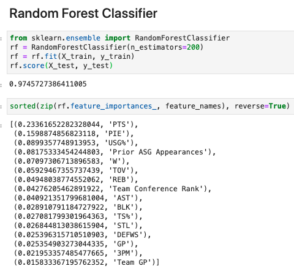

# NBA Stats and Salary Analysis

## Objective
<strong>Use machine learning to predict the next big NBA player</strong>

Data analysis of NBA salaries and player stats, such as player position, minutes played per game, All Star status, biometrics, and injuries to train machine learning models to learn important factors of the most successful players to predict who the next big players will be and evaluation of players' value.

## Tools and Libraries
* Python
* Pandas, Numpy
* Sci-kit Learn
* Plotly
* JSON, CSV
* HTML, CSS
* Javascript
* Flask
* Tableau

## Datasets
* https://pypi.org/project/nba-api/
* https://sportsdata.io/developers/data-dictionary/nba
* http://www.espn.com/nba/salaries


## Presentation Site
https://nbs-stats-predict.herokuapp.com/

***

## Analysis Details

### All-Star Achievement 
Analysis of All-Star and non All-Star players ranging from 1996 to 2018 to find correlation between All-Star achievements and player salary. Using Plotly scatter graphs confirmed that all the highest salaries were also All-Stars. We used this insight to use All-Star status as a benchmark to train and test machine learning models to predict player's success and identify which stats were most important. We ran 2 classification models from Sci-kit Learn to train and test our dataset using All-Star achievement as the target against player stats, such as games played, wins, rebounds, blocks and steals.

Decision Tree Classifier scored a 96% on test data:
<br>


Random Forest Classifier scored 97% on test data. We used Sci-Kit Learn's `feature_importances_` function to highlight which stats were the most important in predicting player's path to the All-Stars:
<br>


Link to All-Star analysis: https://xxxxxxxxx

### Health and Biometrics
<br> Sportsdata API was used combined along with NBA API in order to look at the biometrics.   Body Mass Index is a good gauge of body fat. The most basic definition of overweight and obesity is having too much body fat-so much so that it “presents a risk to health.” A reliable way to determine whether a person has too much body fat is to calculate the ratio of their weight to their height squared. This ratio, called the body mass index (BMI), accounts for the fact that taller people have more tissue than shorter people, and so they tend to weigh more.  This is something to take into importance because most basketball players are tall. </br>

<br>Looking at all the features such as Height, Weight, Salary, Experience, BMI, Avg Age, Number of Seasons, Number of Games, and Minutes Per Game, the feature that was the most correlated to BMI was Weight by .63 coefficient correlation. </br>

```python
     def agg_stats(rows):
    num_season = rows['SEASON_ID'].nunique()
    num_games = rows['GP'].sum()
    min_game = (rows['MIN']/rows['GP']).mean()
    age = rows['PLAYER_AGE'].max()
    return pd.Series({'age': age, 'num_season': num_season, 'num_games': num_games, 'min_game': min_game})
```

```python
player_stats = stats.groupby('PLAYER_NAME').apply(agg_stats).reset_index()
player_stats.head()
```

```python
combined = healthinfo_df.merge(player_stats, on='PLAYER_NAME')
```

```python
combined.corr()
```


<br>Link to APIs are below:</br>
<br>https://sportsdata.io</br>
</br>https://pypi.org/project/nba-api/</br>

### Injuries
Player's injuries were analyzed and measured against salary to find a correlation between the two. To perform this analysis, active player’s data was extracted from sportsdata.io through an API and joined with an injury csv file obtained from Kaggle’s Competition site.  The extracted data was cleaned in python and plotted using Tableau.
Our findings indicate many NBA player’s have long and successful careers despite multiple injuries.

Link to Tableau visuals: https://public.tableau.com/views/NBAPlayersInjuriesAnalysis/NBAPlayersInjuries?:language=en&:display_count=y&publish=yes&:origin=viz_share_link

### Salary Analysis
xxxxx

https://xxxxxxxxx
