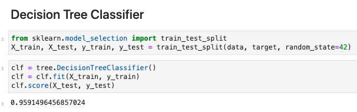

# NBA Analysis

## Objective
<strong>Use machine learning to predict the next big NBA star</strong>

Data analysis of NBA salaries and player stats, such as player position, minutes played per game, All Star status, biometrics, and injuries to train machine learning models to learn important factors of the most successful players to predict who the next big players will be and evaluation of players' value.

## Tools and Libraries
* Python
* Pandas, Numpy
* Sci-kit Learn
* Plotly
* JSON, CSV
* HTML, CSS
* Javascript
* Flask
* Tableau

## Datasets
* https://github.com/swar/nba_api
* https://sportsdata.io/developers/data-dictionary/nba
* http://www.espn.com/nba/salaries

## Presentation Site
https://xxxxxxxxx

## Analysis Details

### All-Star Achievement 
Analysis of All-Star and non All-Star players ranging from 1996 to 2018 to find correlation between All-Star achievements and player salary. Using scatter plot confirmed that all the highest salaries were also All-Stars. We used this insight to use All-Star status as a benchmark to train and test machine learning models to predict player's success. We ran 2 classification models to train and test our dataset using All-Star achievement as the target against player stats, such as games played, wins, rebounds, blocks and steals.

https://xxxxxxxxx

#### Health and Biometrics
xxxxx

https://xxxxxxxxx

#### Injuries
xxxxx

https://xxxxxxxxx

#### Salary Analysis
xxxxx

https://xxxxxxxxx
